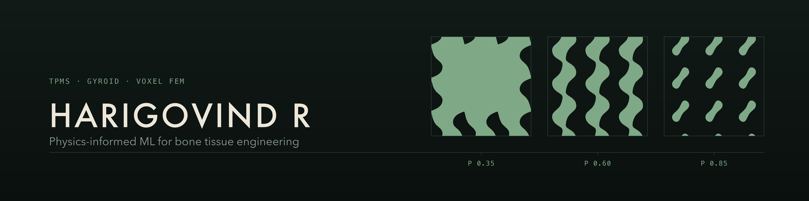

🎓 Final-year B.Tech in AI & ML — Chinmaya Vishwa Vidyapeeth  
🔬 I like problems where the model has to survive contact with real data  
⚡ Currently working on physics-informed ML for bone tissue engineering

---

## 🔬 Featured — Bone Scaffold Property Prediction & Inverse Design

Predicting the mechanical and degradation behaviour of biopolymer bone scaffolds from
composition, process and architecture — then running that model **backwards** to propose a
scaffold worth printing.

A voxel FEM sweep over **747 geometries across 10 architectures**, fused with scarce real
data by multi-fidelity co-kriging, wrapped in a constrained inverse-design search.

**What came out of it:**

| Question | Result |
|---|---|
| Does random-split validation lie? | **Yes — by +0.242.** Random 5-fold claims 0.826 accuracy; grouping by publication gives 0.584, barely past the 0.555 majority-class baseline. |
| Does the ML surrogate beat the physics? | **No.** Leave-one-architecture-out: the Gibson–Ashby law scores R² = **0.733**, the learned surrogate **0.555**. So the physics ships and the surrogate doesn't. |
| Is multi-fidelity fusion worth the trouble? | **Yes.** With 4 trusted datapoints the fused model reaches R² = 0.678 — those same 4 points alone give **−0.830**, an unusable model. |
| How many candidate designs actually survive? | **266 of 725.** The rest fail connectivity, pore size, strut printability or porosity. |

Three ideas the whole thing rests on: validation is **grouped, never random**; a feature is
either a design variable or a solved one, and that split is enforced in code rather than by
convention; and clinical constraints are **filters, not weights** — a good stiffness score
should never be able to buy off a fatal geometry.

`Python` · `NumPy` · `SciPy` · `scikit-learn` · voxel FEM · co-kriging · a dependency-free web UI

> 🔒 Private repository — this is my thesis work. Happy to walk through the code or the
> results, just reach out.

---

## 🛠️ Skills

**Scientific computing & ML**

    

Finite element methods · Gaussian processes · multi-fidelity fusion · leakage-aware validation · Matplotlib

**Web**

     

**Mobile**

 

**Tools**

   

---

## 📌 Other Projects

| Project | What it is | Stack |
|---|---|---|
| [**Agent-Api-Task**](https://github.com/Harigovind777/Agent-Api-Task) | Express task API with agent-ready endpoints, filtering, stats, comments and validation | JavaScript, Express |
| [**medlab-site**](https://github.com/Harigovind777/medlab-site) | Distributor website for Medlab Enterprises (AOSYS) | HTML, CSS |
| **zsi_app** 🔒 | Flutter app for the Zoological Survey of India — data collection for the zoology department | Dart, Flutter |
| **Website** 🔒 | Voter lookup for a panchayath — resident and booth-level counts | TypeScript |

---

## 📫 Connect

- 📧 **Email** — [hg155158@gmail.com](mailto:hg155158@gmail.com)

---

⭐️ From Harigovind R
