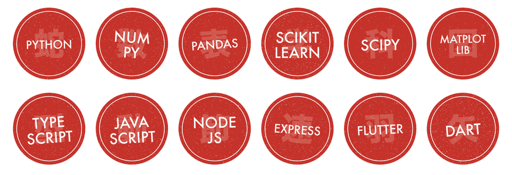

  <b>Final-year B.Tech in AI &amp; ML</b> · Chinmaya Vishwa Vidyapeeth 
  I like problems where the model has to survive contact with real data — 
  right now that means physics-informed ML for bone tissue engineering.

  ◆ &nbsp;currently: voxel FEM sweeps, co-kriging, and trying hard to prove my own model wrong&nbsp; ◆

---

## 技 &nbsp;·&nbsp; The stack

  

  also — finite element methods · Gaussian processes · multi-fidelity fusion · leakage-aware validation · Git · HTML/CSS

---

## 研究 &nbsp;·&nbsp; Featured — Bone Scaffold Property Prediction & Inverse Design

Predicting the mechanical and degradation behaviour of biopolymer bone scaffolds from
composition, process and architecture — then running that model **backwards** to propose a
scaffold worth printing.

A voxel FEM sweep over **747 geometries across 10 architectures**, fused with scarce real
data by multi-fidelity co-kriging, wrapped in a constrained inverse-design search.

**What came out of it:**

| Question | Result |
|---|---|
| Does random-split validation lie? | **Yes — by +0.242.** Random 5-fold claims 0.826 accuracy; grouping by publication gives 0.584, barely past the 0.555 majority-class baseline. |
| Does the ML surrogate beat the physics? | **No.** Leave-one-architecture-out: the Gibson–Ashby law scores R² = **0.733**, the learned surrogate **0.555**. So the physics ships and the surrogate doesn't. |
| Is multi-fidelity fusion worth the trouble? | **Yes.** With 4 trusted datapoints the fused model reaches R² = 0.678 — those same 4 points alone give **−0.830**, an unusable model. |
| How many candidate designs actually survive? | **266 of 725.** The rest fail connectivity, pore size, strut printability or porosity. |

Three ideas the whole thing rests on: validation is **grouped, never random**; a feature is
either a design variable or a solved one, and that split is enforced in code rather than by
convention; and clinical constraints are **filters, not weights** — a good stiffness score
should never be able to buy off a fatal geometry.

`Python` · `NumPy` · `SciPy` · `scikit-learn` · voxel FEM · co-kriging · a dependency-free web UI

> 🔒 Private repository — this is my thesis work. Happy to walk through the code or the
> results, just reach out.

---

## 作品 &nbsp;·&nbsp; Other projects

| Project | What it is | Stack |
|---|---|---|
| [**Agent-Api-Task**](https://github.com/Harigovind777/Agent-Api-Task) | Express task API with agent-ready endpoints, filtering, stats, comments and validation | JavaScript, Express |
| [**medlab-site**](https://github.com/Harigovind777/medlab-site) | Distributor website for Medlab Enterprises (AOSYS) | HTML, CSS |
| **zsi_app** 🔒 | Flutter app for the Zoological Survey of India — data collection for the zoology department | Dart, Flutter |
| **Website** 🔒 | Voter lookup for a panchayath — resident and booth-level counts | TypeScript |

---

## 連絡 &nbsp;·&nbsp; Reach me

Open to research collaborations and internships in ML for materials, biomechanics, or scientific computing.

